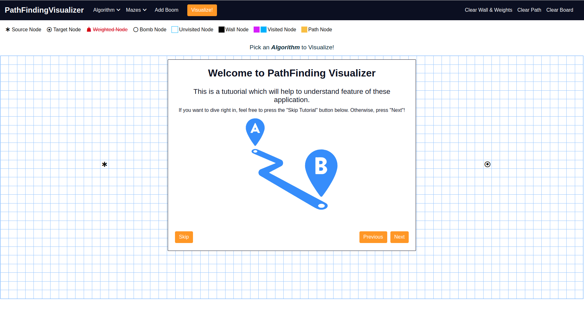

 

# PathFinding Visualizer

This is a simple Angular project which help to visualize various Pathfinding Algorithms.
This project was generated with [Angular CLI](https://github.com/angular/angular-cli) version 15.0.4.


## Algorithm you can visualize

- Breath-first Search (unweighted): a great algorithm; guarantees the shortest path.
- Depth-first Search (unweighted): a very bad algorithm for pathfinding; does not guarantee the shortest path.
- Dijistras Algorithm (weighted): the father of pathfinding algorithms; guarantees the shortest path.
- More to be added.

## Building from source

Clone this repository and run

```
npm install
```
```
ng build
```

The build will result in a single `index.html` and other `.js`  file that is made available in the `docs` directory.


## Running the application

```
ng serve --open
```

Navigate to http://localhost:4200 to access the application.

### Deploy Project <br/>

[Check out the deploy website here](https://manishdait.github.io/Pathfinding-Visualizer/)

 <br/>
 <br/>
 <br/>

### Demo
 <br/>